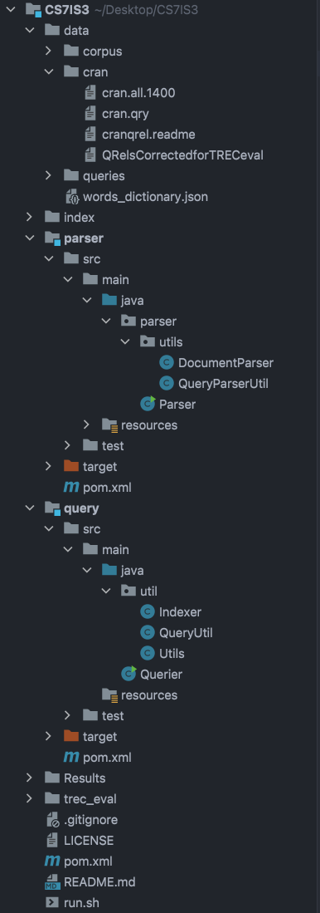

# Assignment 1: CS7IS3

### Directory Structure

The project is located in the 'mayank' folder in the root directory. <br>

```bash
$ cd mayank/CS7IS3
```



There are two modules in this project

#### parser

This module parses the cranfield dataset and queries. <br>
To parse the cranfield dataset, we can use the `DocumentParser` class. It scans the `cran.all.1400` file (uses regex
`.[A-Z]` as a delimiter) and writes it to `data/corpus/{id}.txt` <br>
To parse the queries from `cran.qry`, we can use the `parserQuery` method in `QueryParserUtil` class which returns
a `LinkedHashMap<Integer, String>` of all the queries with their updated IDs. <br>
The `Parser` class has the `main` function of the module which uses `DocumentParser` to create the corpus.

#### query

The `util` package in query contains 3 classes

* `Indexer` class which takes Analyzer and Similarity in its constructor parameters and creates the index
* `QueryUtil` class which takes Analyzer and Similarity in its constructor parameters. It queries the index and creates
  the result file for trec_eval in `Results/results_{analyser}_{similarity}`
* `Utils` class which has utility functions like `getStopWords` and `replacePunctuation`

The `Querier` class contains the main function of the module. It has a list of Analysers and Similarities that are
passed to the `Indexer` to create index and `QueryUtil` to query index and generate the result file. <br>

### Executing JARs

You can run the JARs individually, they're located in the target folder of each module, or you can just run

```bash
$./run.sh
```
